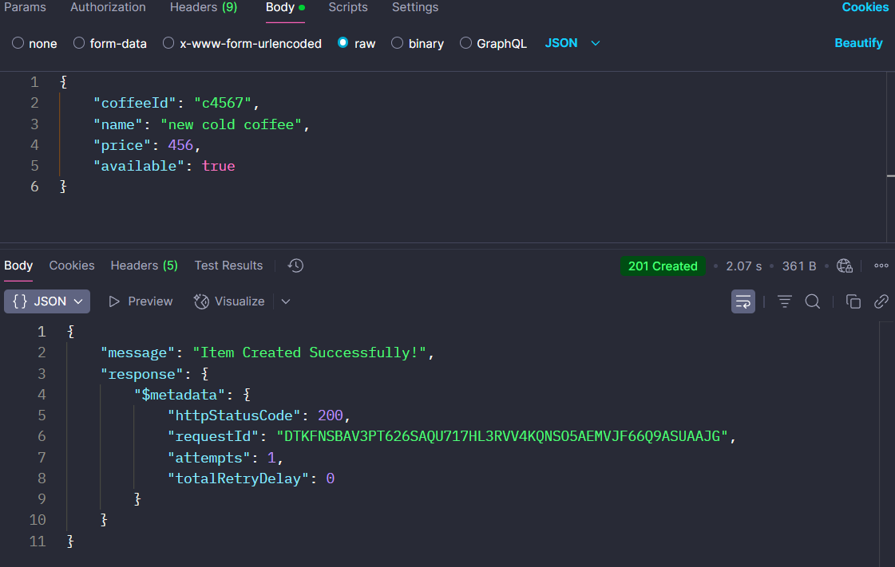

# Coffee Shop API Project Setup

This guide outlines the steps to create a Coffee Shop API using AWS services, Lambda functions, DynamoDB, and API Gateway. The project includes backend functions for managing coffee items (GET, POST, PUT, DELETE), and a frontend React app to interact with the API.

### Tools Used:

* **AWS Lambda** (for backend logic)
* **AWS API Gateway** (for exposing HTTP routes)
* **AWS DynamoDB** (for storing coffee data)
* **Node.js** (runtime for Lambda functions)
* **React** (frontend framework)
* **Postman** (for testing API)
* **AWS CloudWatch** (for monitoring and troubleshooting Lambda function execution)
---

### **Step 1: Set Up DynamoDB Table**

1. Go to the **AWS Console** → **DynamoDB**.
2. Create a new table named `CoffeeShop` with `coffeeId` as the partition key.
3. Add a new item (coffee) in the table:

   ```json
   {
       "coffeeId": "c123",
       "name": "new cold coffee",
       "price": 456,
       "available": true
   }
   ```

### **Step 2: Create IAM Role for Lambda Functions**

1. Create a new IAM role named **CoffeeShopRole** with the following permissions:

   * DynamoDB actions: `PutItem`, `DeleteItem`, `GetItem`, `Scan`, `UpdateItem`
   * CloudWatch logs permissions.
2. The policy for this role will look like this:

   ```json
   {
       "Version": "2012-10-17",
       "Statement": [
           {
               "Effect": "Allow",
               "Action": [
                   "dynamodb:PutItem",
                   "dynamodb:DeleteItem",
                   "dynamodb:GetItem",
                   "dynamodb:Scan",
                   "dynamodb:UpdateItem"
               ],
               "Resource": "arn:aws:dynamodb::<DYNAMODB_TABLE_NAME>"
           },
           {
               "Effect": "Allow",
               "Action": [
                   "logs:CreateLogGroup",
                   "logs:CreateLogStream",
                   "logs:PutLogEvents"
               ],
               "Resource": "*"
           }
       ]
   }
   ```

### **Step 3: Create Lambda Functions and Lambda Layer**

1. **Lambda Layer**: Create a Lambda layer with the required DynamoDB libraries and common utilities.

   * Create a `nodejs` directory, run `npm init` and install dependencies:

     ```bash
     npm install @aws-sdk/client-dynamodb @aws-sdk/lib-dynamodb
     ```
   * Create a `utils.mjs` file for shared functions:

     ```javascript
     import { DynamoDBClient } from "@aws-sdk/client-dynamodb";
     import {
         DynamoDBDocumentClient,
         ScanCommand,
         GetCommand,
         PutCommand,
         UpdateCommand,
         DeleteCommand
     } from "@aws-sdk/lib-dynamodb";

     const client = new DynamoDBClient({});
     const docClient = DynamoDBDocumentClient.from(client);

     const createResponse = (statusCode, body) => {
         return {
             statusCode,
             headers: { "Content-Type": "application/json" },
             body: JSON.stringify(body),
         };
     };

     export {
         docClient,
         createResponse,
         ScanCommand,
         GetCommand,
         PutCommand,
         UpdateCommand,
         DeleteCommand
     };
     ```
   * Zip the content of `nodejs` and upload it as a Lambda Layer (`layer.zip`).

2. **Create Lambda Functions**: Create Lambda functions for CRUD operations:

   * `getCoffee`, `createCoffee`, `updateCoffee`, `deleteCoffee`.
   * Attach the `Dynamo-Layer` to each Lambda function.

### **Step 4: API Gateway Setup**

1. **Create API Gateway** and add routes for the Lambda functions:

   * `GET /coffee` → `getCoffee` function
   * `GET /coffee/{id}` → `getCoffee` function
   * `POST /coffee` → `createCoffee` function
   * `PUT /coffee/{id}` → `updateCoffee` function
   * `DELETE /coffee/{id}` → `deleteCoffee` function

2. **Test API**: Use **Postman** to test:

   * `GET /coffee`: Retrieves all coffee items.
   * `POST /coffee`: Create a new coffee item.
   * `PUT /coffee/{id}`: Update a coffee item.
   * `DELETE /coffee/{id}`: Delete a coffee item.

### **Step 5: Frontend Setup**

1. **React Application**:

   * Create a `frontend` directory and run the following commands:

     ```bash
     npm create vite@latest .
     npm install
     npm run dev
     npm install react-router-dom
     ```

2. **Set API URL**:

   * Create a `.env` file in the frontend root and set the `VITE_API_URL` to the API Gateway invoke URL:

     ```env
     VITE_API_URL=https://<API_GATEWAY_URL>/coffee
     ```

3. **App Structure**:

   * Update `src/main.jsx`, `App.jsx`, and `ItemDetails.jsx` to reflect the coffee shop UI and integrate the API.
   * Create a `utils/apis.js` file to handle API requests.

4. **CORS Configuration**:

   * In API Gateway, go to the CORS settings for `CoffeeShop` and add `localhost` as the allowed origin. Add `content-type` to allowed headers, and enable `GET`, `POST`, `OPTIONS`, `PUT`, and `DELETE` methods.

### **Step 6: Test and Finalize**

1. **Test the entire setup** in Postman:

   * Test all CRUD operations: `GET`, `POST`, `PUT`, and `DELETE` endpoints.
   * Ensure that each operation returns a `200 OK` status.

---

### **Final Notes**

* Make sure that all the AWS resources (Lambda, API Gateway, IAM Role, and DynamoDB) are in the **us-east-1** region.
* Ensure that all Lambda functions have the necessary IAM roles and permissions.
* Use **Postman** or another API client to thoroughly test the API before deploying it to production.


## Challenges

* **IAM Role Permissions**: Configuring the correct IAM permissions for Lambda functions to access DynamoDB and CloudWatch proved challenging. Fine-tuning IAM policies was necessary to ensure proper access rights.

* **CORS Configuration**: Properly setting up CORS in API Gateway to enable communication between the frontend and backend(lambda) was cumbersome, particularly when managing different environments (local vs. deployed). Minor misconfigurations often caused issues.

* **Lambda Function Naming and Configuration**: Ensuring consistency in naming conventions across Lambda functions, CloudWatch, and zip files was critical. Any mismatch resulted in errors, which were time-consuming to resolve, but CloudWatch logs facilitated troubleshooting.


